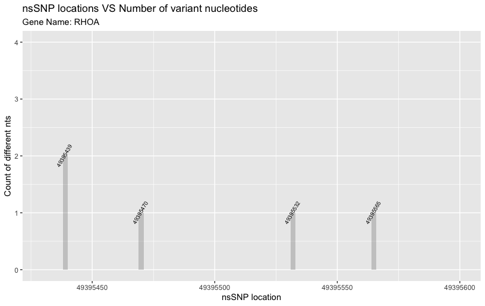

```{r, include = FALSE}
knitr::opts_chunk$set(
  collapse = TRUE,
  comment = "#>"
)
```

 
## Introduction

`nsSNPfinder` is an R package for integrating and analyzing human genome SNP data from the genomic level to the protein level, finding potential nsSNP-associated gene location and visualize it in protein structure.

To download **nsSNPfinder**:

``` r
require("devtools")
devtools::install_github("Yuewei-Wang/nsSNPfinder"，build_vignettes = TRUE)
library(nsSNPfinder)
```

To list all functions available in this package:

```r
ls("package:nsSNPfinder")
```

<br>

## Components
There are 4 functions in the package:

The __*nsSNPCalculatebyRange*__ allows users to input the chromosome name and gene range as arguments, then returns the summary for all transcripts within the input range, with information of gene name, transcript length, number of nsSNPs and the percentage of nsSNPs over the transcript. More information could be viewed in  `?nsSNPCalculatebyRange`.

```r
> nsSNPCalculatebyRange(chrName = 1, startPosition = 2321253, endPosition = 2391707)
  geneName lengths nsSNPs percent
1    MORN1   70302   3072  0.0437
2    MORN1   36533   1521  0.0416
3    MORN1   13485    686  0.0509
4    MORN1    1993    119  0.0597
> nsSNPCalculatebyRange(chrName = 2,startPosition = 85394753, endPosition = 85418432)
  geneName lengths nsSNPs percent
1     CAPG   15614    621  0.0398
2     CAPG    3982    178  0.0447
3     CAPG   15604    636  0.0408
4     CAPG   19215    746  0.0388
5     CAPG   19182    743  0.0387
6     CAPG   10126    431  0.0426
7     CAPG   11143    467  0.0419
8     CAPG   15350    578  0.0377
9     CAPG   19287    670  0.0347
```

The __*SNPFreqPlot*__ allows users to input the chromosome name and gene range as arguments, then returns a plot to visualize the SNP locations versus the number of different nucleotide variants within input range. Each location is labeled with coordinate, more information could be viewed in `?SNPFreqPlot`.

```r
> SNPFreqPlot(chrName = 3, startPosition = 49395430, endPosition = 49395600)
```
<div style="text-align:center">
<div style="text-align:left">

<br>

<div style="text-align:left">
The __*nsSNPFreqPlot*__ has the similar function as __*SNPFreqPlot*__ but the targets are nsSNP instead. This function also requires chromosome name and gene range as arguments, then returns a plot for nsSNPs. More information could be viewed in `?nsSNPFreqPlot`.

```r
> nsSNPFreqPlot(chrName = 3, startPosition = 49395430, endPosition = 49395600)
```
<div style="text-align:center">
<div style="text-align:left">

<br>

<div style="text-align:left">
The __*displayPDB*__ allows users to input gene name, chromosome name and specific nsSNP coordinate within the gene, then returns the 3D structure of the gene-encoded protein from PDB, also label the nsSNP-associated residue within the structure. More information could be viewed in `?displayPDB`.

```r
> displayPDB(chrName = 3, geneName = 'RHOA',nsPos = 49395565)
```
<div style="text-align:center">
<div style="text-align:left">

<br>

<div style="text-align:left">

## Package References

[Wang, Y. (2021). nsSNPfinder: an R package for integrating, analyzing, and visualizing the SNP data from the genomic level to the protein level. ](https://github.com/Yuewei-Wang/nsSNPfinder.git)

## Other References

[Durinck, S., Spellman, P., Birney, E.,& Huber, W. (2009). Mapping identifiers for the integration ofgenomic datasets with the R/Bioconductor package biomaRt. *Nature Protocols*, 4, 1184–1191.2. ](https://bioconductor.org/packages/biomaRt/)

[Durinck, S., Moreau, Y., Kasprzyk, A., Davis, S., De Moor, B., Brazma, A.,& Huber, W. (2005).BioMart and Bioconductor: a powerful link between biological databases and microarray data analysis.*Bioinformatics*, 21, 3439–3440. ](https://bioconductor.org/packages/biomaRt/)

[Pagès, H., Aboyoun, P., Gentleman, R., DebRoy, S. (2021). Biostrings: Efficient manipulation of biological strings. R package version 2.62.0. ](https://bioconductor.org/packages/Biostrings/)

[Pagès, H. (2017). SNPlocs.Hsapiens.dbSNP144.GRCh38: SNP locations for Homo sapiens (dbSNPBuild 144). R package version 0.99.20.](https://bioconductor.org/packages/SNPlocs.Hsapiens.dbSNP144.GRCh38/)

[Pagès H (2021). BSgenome: Software infrastructure for efficient representation of full genomes and their SNPs. R package version 1.62.0. ](https://bioconductor.org/packages/BSgenome.)

[Su, W (2020). r3dmol: Create Interactive 3D Visualizations of Molecular Data.
R package version 0.1.0. https://github.com/swsoyee/r3dmol ](https://cran.r-project.org/web/packages/r3dmol/index.html)

[Team TBD (2021). BSgenome.Hsapiens.UCSC.hg38: Full genome sequences for Homo sapiens (UCSC version hg38, based on GRCh38.p13). R package version 1.4.4. ](https://bioconductor.org/packages/BSgenome.Hsapiens.UCSC.hg38/)

[Wickham, H. (2016). ggplot2: Elegant Graphics for Data Analysis. Springer-Verlag
New York. ISBN 978-3-319-24277-4, https://ggplot2.tidyverse.org.  ](https://cran.r-project.org/web/packages/ggplot2/index.html)

[Xiao, N., Cao, DS., Zhu, MF., Xu, QS. (2015). protr/ProtrWeb: R package and 
web server for generating various numerical representation schemes of protein 
sequences. *Bioinformatics* 31 (11), 1857-1859. ](https://cran.r-project.org/web/packages/protr/vignettes/protr.html)


----

```{r}
sessionInfo()
```
